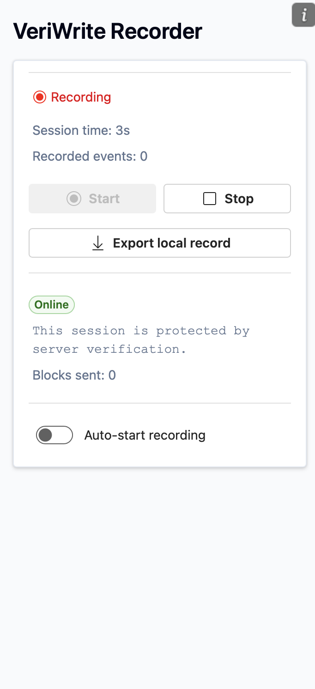
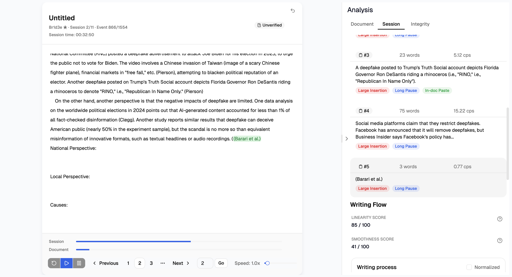
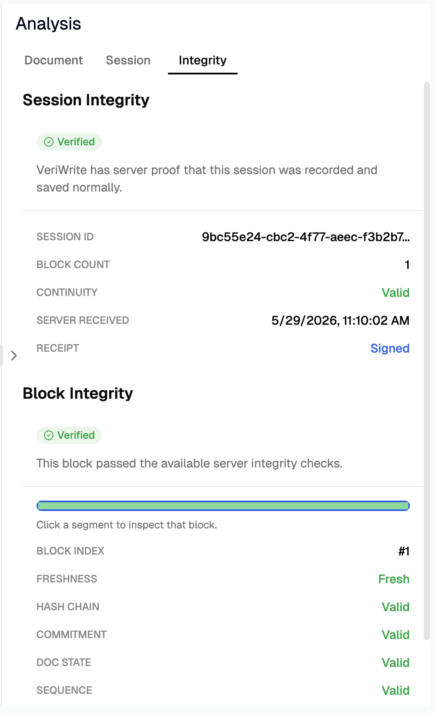
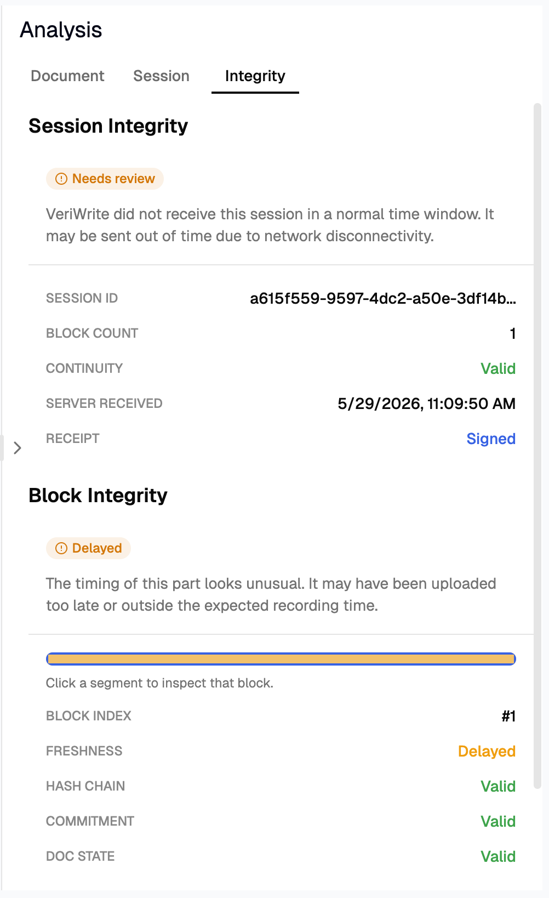

# VeriWrite

VeriWrite is a writing-process evidence system for academic integrity review.

It helps students preserve evidence of how they wrote a document, and helps teachers replay and inspect that writing process before making an academic integrity judgment.

> VeriWrite is not an AI detector. It does not prove or disprove originality by itself. It should be treated as an evidence packet that supports human review.

## Contents

- [What Is VeriWrite?](#what-is-veriwrite)
- [How It Is Used](#how-it-is-used)
- [Flight Recorder](#flight-recorder)
- [Record Replayer](#record-replayer)
- [Data Integrity Model](#data-integrity-model)
- [What The Integrity Proof Helps Detect](#what-the-integrity-proof-helps-detect)
- [Offline Recovery Mode](#offline-recovery-mode)
- [Limitations And Challenges](#limitations-and-challenges)
- [Motivation](#motivation)
- [Project Structure](#project-structure)
- [Current Status](#current-status)

## What Is VeriWrite?

VeriWrite provides writing-process evidence for students and teachers.

The core workflow:

1. A student records their writing process in Microsoft Word.
2. The recorder stores timestamped document-change events.
3. The record server verifies and signs integrity evidence.
4. A teacher loads the record in the replayer.
5. The teacher reviews playback, statistics, and server-side integrity status.

The goal is to reduce over-reliance on black-box AI detector scores and give students a concrete way to show their work history.

## How It Is Used

### Student Side

Students use the **VeriWrite Flight Recorder**, a Microsoft Word add-in, while writing an assignment.

The recorder observes document changes, groups them into sessions and blocks, and sends integrity evidence to the record server.

  

### Teacher Side

Teachers use the **VeriWrite Record Replayer** to load a student's record and inspect:

- writing playback
- session-level progress
- document-level statistics
- paste and revision indicators
- continuity gaps
- block-level integrity and freshness status

## Flight Recorder

The Flight Recorder captures writing activity as compact edit events.

Each event stores:

| Field    | Meaning                               |
| -------- | ------------------------------------- |
| `dt`     | elapsed time since the previous event |
| `pos`    | edit position                         |
| `delLen` | number of deleted characters          |
| `ins`    | inserted text                         |

The recorder polls and detects keystroke-level document changes through the Microsoft Word API.

Recorded data is grouped into:

| Unit        | Meaning                                     |
| ----------- | ------------------------------------------- |
| **Session** | one continuous writing period               |
| **Block**   | a short fixed-period batch inside a session |

Each block contains event data, timing data, document state hashes, and integrity metadata. The block payload is encrypted and sent to the record server.

### Online / Offline Hybrid Support

VeriWrite keeps recording when the internet connection is unstable.

If connection is lost during recording, the recorder continues storing local writing events. When connectivity returns, delayed blocks or sessions can be sent to the server.

The server can then mark those blocks with a weaker freshness status instead of treating them as live evidence.

## Record Replayer

The Record Replayer reconstructs a student's writing process from recorded events.

It applies the event stream back onto the initial document text and displays the writing process over time.

The replayer also provides supporting analysis:

- writing timeline
- session breakdowns
- paste indicators
- revision indicators
- document continuity checks
- session-level statistics
- block-level integrity status
- freshness status

  

The purpose is to help teachers understand the writing process, not to automatically judge the student.

## Data Integrity Model

VeriWrite P3 adds server-side integrity evidence to the writing record.

### Block Hash Chain

Each block includes a previous-block hash.

The server checks that blocks arrive in the expected sequence and that each block links to the previous one.

This helps detect:

- deleted blocks
- reordered blocks
- replaced blocks
- gaps in the recorded block chain

### Document State Hash

Each block includes a hash of the document state after applying that block's events.

The server verifies that the submitted event batch transforms the previous document state into the claimed new document state.

This helps detect document changes that happen outside the recorded event stream.

### Block Commitment Hash

Each block has a commitment hash over:

- block header
- encrypted payload
- authentication tag
- freshness challenge data

The server recomputes this commitment and verifies that the submitted block matches its claimed hash.

### AEAD Encryption

Block payloads are encrypted with authenticated encryption.

This protects payload confidentiality and provides tamper detection for encrypted block data.

### Freshness Status

The server issues freshness challenges with expiration windows.

Blocks are classified based on whether they were received within the expected window:

| Status    | Meaning                                               |
| --------- | ----------------------------------------------------- |
| `FRESH`   | received within the expected live window              |
| `DELAYED` | valid block, but received after the live window       |
| `STALE`   | freshness evidence is too old or no longer acceptable |

For example, if a student disables internet during recording and reconnects later, the writing data can still be stored, but the evidence level is weaker and shown as delayed.

### Server Signatures

After verification, the server signs block receipts and session final receipts using Ed25519.

These receipts are shown in the teacher-side replayer so the teacher can see which parts of the record were verified by the server.

  
  

## What The Integrity Proof Helps Detect

The integrity system is designed to address practical evidence problems such as:

- a student writes normally, then turns off the recorder and changes the document
- a student disables internet during recording and uploads data later
- block data is modified after creation
- block sequence is broken, reordered, or partially missing
- document state does not match the submitted event stream

In these cases, the replayer can show degraded or invalid integrity status instead of silently treating the record as fully verified.

## Offline Recovery Mode

VeriWrite introduces a backup option that makes records available even when the student completes their writing entirely offline.

> Note: offline backup mode is preferable only when online recording is unavailable because of internet connection issues. It does not guarantee server-backed evidence of data integrity. Integrity statistics that depend on server proof are not available for fully offline records.

### Word Add-in File Architecture

In the **VeriWrite Flight Recorder** Microsoft Word add-in, the `Export local record` button exports a unique `.vw` _VeriWrite Record_ file.

### The `.vw` Container

VeriWrite uses an enhanced record file structure built around _MessagePack_ serialization.

The `.vw` format makes exports and imports more efficient. It also stores the writing record as a binary payload, which makes accidental manual modification harder than with plain JSON.

The current `.vw` binary format is structured as follows.

#### Heading

- Magic bytes: `VWFR`, which stands for _VeriWrite Flight Record_
- Version: `1`
- Codec ID: `1` (_MessagePack_ serialization)
- Record start index: the byte position where the actual writing record begins
- Hash checksum: a SHA-256 checksum of the serialized record, used to detect whether the exported record has been changed or damaged

#### Payload

- Flight record: serialized writing record using _MessagePack_

### Replayer Dashboard Support

VeriWrite Replayer supports both the previous `.json` format and the upgraded `.vw` record format.

When a teacher uploads a record, the replayer first checks whether the file matches the expected flight record structure. For `.vw` files, it also recomputes the SHA-256 checksum from the serialized record payload. If the checksum does not match, the replayer immediately warns that the record may have been damaged or changed.

## Limitations And Challenges

VeriWrite should be treated as an evidence system, not a final decision system.

### It Does Not Prove

- that a work is original
- that a student did or did not use AI
- that a student should be punished or cleared automatically

### Known Limitations

- Replayer statistics are derived from Microsoft Word API data and local algorithms.
- Statistics may be inaccurate because of API performance constraints, sampling behavior, and algorithmic limits.
- Generated reports use carefully prompted LLMs but can still be mistaken.
- `.vw` offline recovery records do not generally prove originality or writing integrity. Stronger evidence must rely on server verification.
- Server-side integrity checks do not fully solve fake or unauthorized clients.
- Server-side integrity checks do not fully prevent automated scripts that type text into Word while the recorder is running.

Teachers should use VeriWrite as one source of evidence, together with conversation, drafts, assignment context, writing history, and human judgment.

## Motivation

VeriWrite was motivated by the problem of students being accused of AI use based on unreliable detector scores.

AI detectors can produce false positives, and some research suggests that non-native English writers may be disproportionately affected by these tools.

VeriWrite aims to give students a more transparent way to provide evidence of their writing process.

## Project Structure

| Path                                    | Purpose                                      |
| --------------------------------------- | -------------------------------------------- |
| `word-addin/VeriWrite Flight Recorder/` | Microsoft Word add-in recorder               |
| `backend/record_server/`                | FastAPI record server and PostgreSQL storage |
| `backend/LLM/`                          | replayer stats panel LLM integration         |
| `replayer/`                             | teacher-side writing process replayer        |

## Current Status

- Microsoft Word flight recorder
- compact event-based writing record format
- migration to a compact binary `.vw` format for more robust offline recovery
- multi-session replayer
- replay controls
- session navigation
- session-level statistics
- document-level statistics
- LLM-assisted analysis
- integrity verification design and implementation
- server-backed verification concept using block hash chains and signed results
- improved UI polish
- better demo workflow

Planned / future work:

- stronger server-backed verified mode
- future batch / receipt architecture
- deployment, putting the VeriWrite product into practice if possible

---
